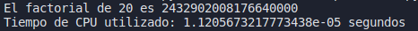
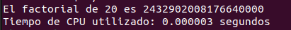

# Parcial Lenguajes | Ejecución de programas

## 1. Ejecutar el programa de AFD en Python

1. Abre una terminal y navega hasta la ubicación del archivo `AFD.py`.
2. Ejecuta el programa con el siguiente comando, reemplazando `+` por la expresión regular que desees probar:
  
   ```bash
   python AFD.py "+"
   ```

Si la expresión regular es `+`, el programa imprimirá `SUMA`.

## 2. Ejecutar el programa de gramática regular en FLEX

1. Guarda el código de la gramática regular en un archivo llamado `lambda.l`.
2. Compila el archivo `lambda.l` con FLEX para generar el archivo `lex.yy.c`:
   
   ```bash
   flex lexer.l
   ```

3. Compila el archivo `lex.yy.c` con un compilador C, por ejemplo, GCC:
   
   ```bash
   cc lex.yy.c -lfl
   ```

4. Crea un archivo de texto llamado `test.txt` con la expresión lambda que deseas probar.
5. Ejecuta el programa con el siguiente comando

   ```bash
   ./a.out test.txt
   ```

El programa imprimirá ACEPTA si la expresión es aceptada por la gramática regular.

## 3. Ejecutar el programa en C para buscar una palabra clave en un archivo de texto

1. Compila el programa con GCC:

   ```bash
   gcc BuscarPalabras.c -o buscarpalabras
   ```

2. Ejecuta el programa con los siguientes parámetros, reemplazando `archivo` por el nombre del archivo de texto y `key` por la palabra clave que deseas buscar:

   ```bash
   ./buscarpalabras receta.txt arroz
   ```


El programa imprimirá la cantidad de veces que la palabra clave se repite en el texto.

## 4. Comparación del rendimiento de un lenguaje compilado y un lenguaje interpretado

Para hacer la comparación de rendimiento se realizará la operación de factorial de 20 y se tendrá en cuenta el tiempo de CPU utilizado, en este caso tenemos los siguiente resultados:

- **Python**

   

- **C**

   


Como resultado obteniendo que C es mucho mas eficiente y rápido.


## 5. Ejecutar el programa en ANTLR para calcular funciones trigonométricas

1. Guarda el código de la gramática en un archivo llamado `SenCosTan.g4`.
2. Genera los archivos Java necesarios con ANTLR:
   ```bash
   antlr4 -no-listener -visitor SenCosTan.g4
3. Compila los archivos Java generados:
   ```bash
   javac Test.java SenCosTan*.java
5. Ejecuta el programa con el siguiente comando:
   ```bash
   java Test expr.in
El programa imprimirá el resultado de cada expresión trigonométrica en el archivo expr.in.


## Miembros del grupo

- Laura González
- Camilo Madero
- Paula Páez
- Felipe Rodriguez


